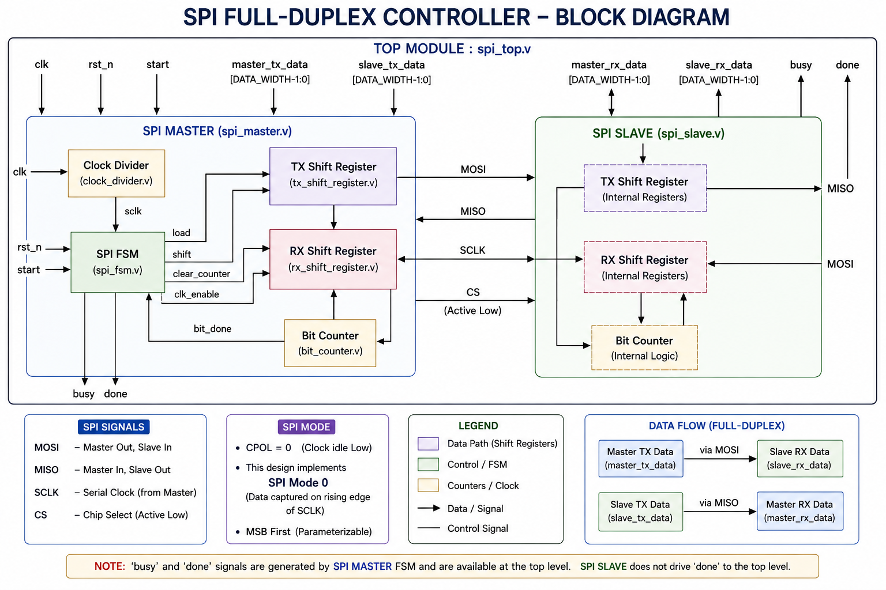
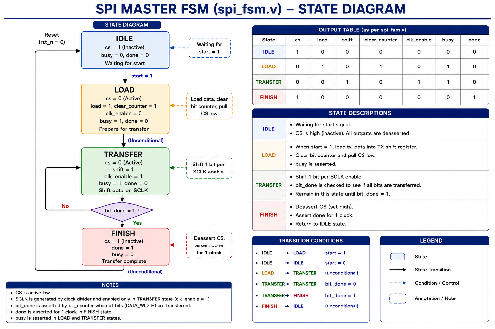
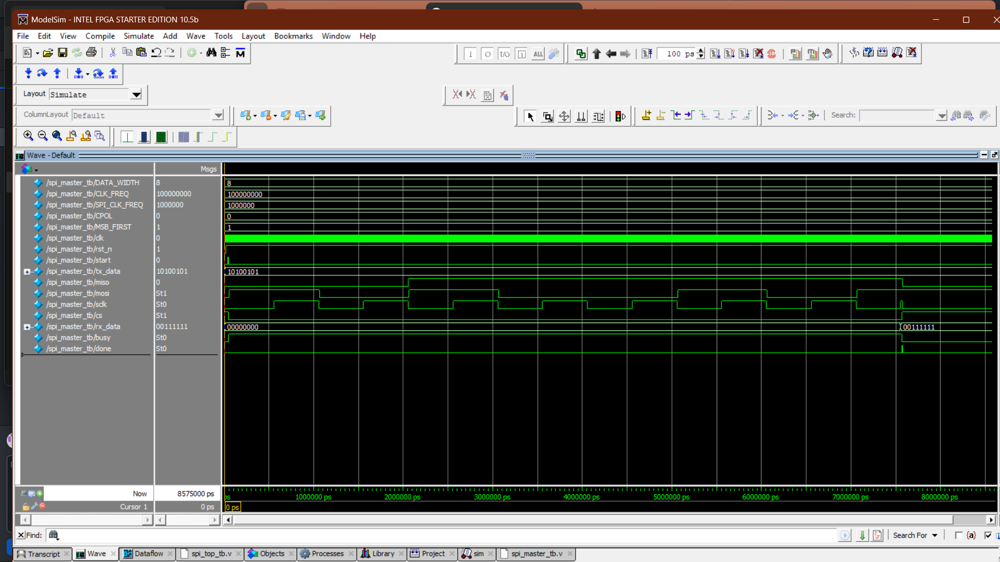
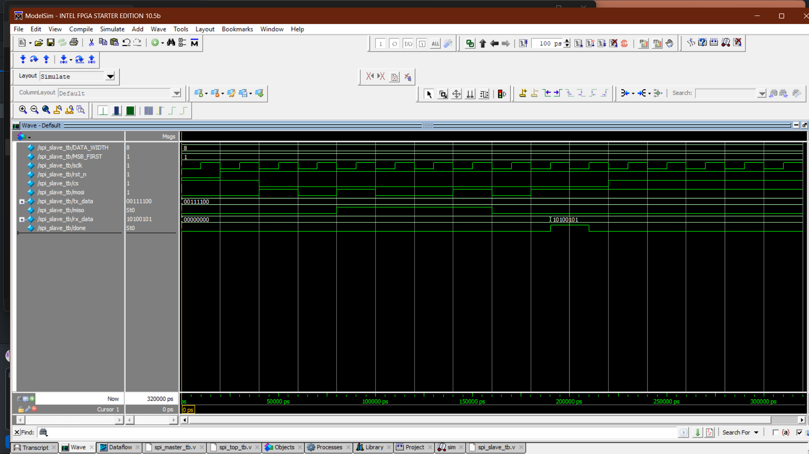
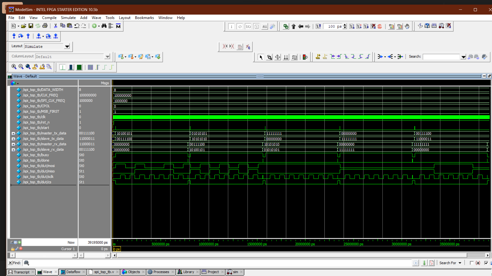

🚀 SPI Full-Duplex Controller Design and Verification using Verilog HDL

> A parameterized SPI (Serial Peripheral Interface) Full-Duplex Controller designed in Verilog HDL with Master-Slave communication and functional verification using ModelSim Intel FPGA Starter Edition.

---

📖 Overview

> This project presents the RTL design and functional verification of an SPI Full-Duplex Controller using Verilog HDL.

> The design consists of an SPI Master, SPI Slave, Clock Divider, TX/RX Shift Registers, Bit Counter, and FSM-based control logic.

> The SPI Master generates the serial clock and chip-select signals, while the Master and Slave simultaneously transmit and receive data through the MOSI and MISO signals.

> Functional verification was performed using ModelSim Intel FPGA Starter Edition to validate SPI clock generation, FSM operation, serial data transmission, serial data reception, and end-to-end data integrity.

---

🎯 Project Objective

> The objective of this project is to design, implement, and verify a modular and parameterized SPI Full-Duplex Controller using Verilog HDL.

> The project demonstrates synchronous serial communication between an SPI Master and Slave while validating:

    • SPI clock generation
    • Chip-select control
    • Full-duplex data transfer
    • Serial data shifting
    • Data reception
    • FSM-based control
    • Bit counting
    • End-to-end communication

---

✨ Features

    • Parameterized SPI Clock Divider
    • Full-Duplex Communication
    • Master and Slave Architecture
    • Configurable Data Width
    • Configurable CPOL
    • SPI Mode 0 Operation
    • Serial TX/RX Shift Registers
    • Bit Counter
    • FSM-Based Control Logic
    • Modular RTL Design
    • Dedicated Master and Slave Testbenches
    • Top-Level System Integration
    • ModelSim Waveform Verification
    • RTL Verification

---

📁 Project Structure

    📂 SPI-Full-Duplex-Controller/  
     📂 rtl/ (Design Source Files)  
       📄 spi_master.v  
       📄 spi_slave.v  
       📄 spi_top.v  
       📄 clock_divider.v  
       📄 tx_shift_register.v  
       📄 rx_shift_register.v  
       📄 bit_counter.v  
       📄 spi_fsm.v  
    📂 tb/ (Testbench Verification Files)  
       📄 spi_master_tb.v  
       📄 spi_slave_tb.v  
       📄 spi_top_tb.v  
    📂 docs/ (Design Documentation and Diagrams) 
       🖼️ spi_block_diagram.png
       🖼️ spi_master_fsm.png
    📂 waveforms/ (Simulation Waveform Logs)   
       🖼️ spi_master_waveform.png  
       🖼️ spi_slave_waveform.png
       🖼️ spi_full_duplex_waveform.png
    📄 README.md

---

⚙️ Module Description

🕐 Clock Divider

> The Clock Divider generates the SPI serial clock timing from the system clock.

    Responsibilities:
    • Divides the system clock to generate the required SPI clock
    • Provides controlled timing for SPI data transfer
    • Supports parameterized system-clock and SPI-clock frequencies

---

📤 SPI Master

> The SPI Master controls the SPI communication and initiates data transfers.

    Responsibilities:
    • Generates SCLK
    • Controls active-low Chip Select (CS)
    • Transmits data through MOSI
    • Receives data through MISO
    • Controls serial data shifting
    • Maintains the transfer bit count
    • Generates transfer completion indication

    FSM Control

    The Master control logic uses FSM-based sequencing for:
    • IDLE
    • LOAD
    • TRANSFER
    • FINISH

---

📥 SPI Slave

> The SPI Slave responds to the Master during an active SPI transaction.

    Responsibilities:
    • Monitors Chip Select
    • Receives SCLK from the Master
    • Receives serial data through MOSI
    • Transmits serial data through MISO
    • Performs simultaneous transmit and receive operations
    • Reconstructs received parallel data
    • Maintains transfer bit count

> The SPI Slave uses CS- and SCLK-controlled sequential logic.

> To perform transmit and receive operations during an active.

> SPI transaction, rather than using a separate FSM module.

---

🔄 TX Shift Register

> The TX Shift Register stores parallel transmit data and shifts one bit at a time during SPI communication.

    Responsibilities:
    • Parallel data loading
    • Serial bit shifting
    • MSB-first transmission
    • Controlled shifting according to SPI timing

---

🔄 RX Shift Register

> The RX Shift Register samples incoming serial data and reconstructs the received parallel data.

    Responsibilities:
    • Serial data sampling
    • Bit shifting
    • Parallel data reconstruction
    • MSB-first reception

---

🔢 Bit Counter

> The Bit Counter tracks the number of transferred bits during an SPI transaction.

    Responsibilities:
    • Counts transmitted/received bits
    • Detects completion of the SPI frame
    • Synchronizes transfer progress with the control FSM

---

🎛️ SPI Top Module

    Integrates:
    • SPI Master
    • SPI Slave
    • Clock Divider
    • TX Shift Register
    • RX Shift Register
    • Bit Counter
    • FSM Control Logic
    
    The Master and Slave are interconnected through the SPI communication signals:
    
    • MOSI
    • MISO
    • SCLK
    • CS
---

🏗️ Design Methodology

> The SPI Full-Duplex Controller follows a modular and parameterized RTL design methodology.

    1. Parameterization of SPI data width and clock frequency
    2. SPI clock generation using a clock divider
    3. Parallel transmit-data loading
    4. Serial data transmission
    5. Serial data reception
    6. Shift-register based data handling
    7. Bit counting
    8. FSM-based protocol control
    9. Master-Slave top-level integration
    10. Functional verification using ModelSim

---

💻 Simulation Environment

    • HDL Language
        Verilog HDL

    • Simulation Tool
        ModelSim Intel FPGA Starter Edition 10.5b

    • Code Editor
        Visual Studio Code

    • Version Control
        GitHub

---

✅ Verification Status

> The design was verified at both module and system levels.

          Module / Function           Status

    Clock Divider                  ✅ Verified
    SPI Master                     ✅ Verified
    SPI Slave                      ✅ Verified
    TX Shift Register              ✅ Verified
    RX Shift Register              ✅ Verified
    Bit Counter                    ✅ Verified
    FSM Control                    ✅ Verified
    Top-Level Integration          ✅ Verified
    Full-Duplex Communication      ✅ Passed

---

🧪 Functional Verification

> The following functionality was verified through simulation:

    • SPI clock generation
    • Chip Select assertion and de-assertion
    • Master transmission
    • Master reception
    • Slave transmission
    • Slave reception
    • Full-Duplex data transfer
    • TX shift-register operation
    • RX shift-register operation
    • Bit-counter operation
    • FSM state transitions
    • Busy signal operation
    • Done signal operation
    • Data integrity
    • End-to-end Master-Slave communication

---

🧪 Test Case

    Input Data & Configuration:
    • Master TX Data : 8'hA5 (10100101)
    • Slave TX Data  : 8'h3C (00111100)
    • Data Width     : 8 bits
    • SPI Mode       : Mode 0
    • CPOL           : 0

    Expected Full-Duplex Result:
    • Master RX      : 00111100 = 8'h3C
    • Slave RX       : 10100101 = 8'hA5

> The received data should correspond to the data transmitted by the opposite device, demonstrating simultaneous SPI transmission and reception.

---

🎉 Simulation Results

> The simulation results demonstrate:

    • Successful SPI Master-Slave communication
    • Correct SPI clock generation
    • Correct Chip Select operation
    • Simultaneous transmission and reception
    • Correct serial data shifting
    • Correct bit counting
    • Correct FSM state transitions
    • Correct received data reconstruction
    • Successful full-duplex data exchange
    • Correct transfer completion indication
    • Successful end-to-end system integration

---

📊 Results

> The SPI Full-Duplex Controller successfully demonstrates synchronous serial communication between an SPI Master and Slave.

> The simulation verifies SPI clock generation, Chip Select control, serial data transmission, serial data reception, shift-register operation, bit counting, FSM-based control, and simultaneous full-duplex communication.

    For the test case:
    • Master TX = 8'hA5
    • Slave TX  = 8'h3C

    • Master RX = 8'h3C
    • Slave RX  = 8'hA5

> This confirms bidirectional data exchange during the same SPI transaction.

---

🏗️ SPI Block Diagram

---

🔄 SPI Master FSM

---

📸 Waveforms and RTL Views

📈 SPI Master Waveform

---

📈 SPI Slave Waveform

---

📈 SPI Full-Duplex Top-Level Waveform

---

🛠️ Skills Demonstrated

    • Verilog HDL
    • RTL Design
    • Parameterized RTL Design
    • Finite State Machine (FSM)
    • SPI Communication Protocol
    • Full-Duplex Architecture
    • Shift Register Design
    • Clock Divider Design
    • Functional Verification
    • Testbench Development
    • Waveform Analysis
    • RTL Analysis
    • Modular Hardware Design
    • ModelSim
    • GitHub

---

🚀 Future Enhancements

    • Support for additional SPI modes
    • Multi-Slave SPI support
    • Dual/Quad SPI support
    • FIFO Buffer Integration
    • APB/AHB Register Interface
    • FPGA Hardware Validation
    • Configurable MSB/LSB-First operation
    • Enhanced error/status reporting

---

📚 Learning Outcomes

> Through this project, the following concepts were implemented and verified:

    • RTL Design using Verilog HDL
    • Parameterized RTL Design
    • FSM-Based Hardware Design
    • SPI Communication Protocol
    • SPI Clock Generation
    • Full-Duplex Serial Communication
    • Shift Register Design
    • Bit Counter Design
    • Master-Slave Architecture
    • Modular Hardware Design
    • Functional Simulation
    • Testbench Development
    • Digital System Integration
    • Waveform Analysis
    • RTL Verification
    • ModelSim-Based Verification

---

👨‍💻 Author

A. Harshavardhan  

GitHub Profile: https://github.com/Harshavardhan739

---

📄 License

This project is intended for educational, academic, and learning purposes.
